<picture>
  <source media="(prefers-color-scheme: dark)" srcset="assets/cabecera-dark.svg">
  
</picture>

<picture>
  <source media="(prefers-color-scheme: dark)" srcset="assets/inventario-dark.svg">
  
</picture>

<picture>
  <source media="(prefers-color-scheme: dark)" srcset="assets/logros-dark.svg">
  
</picture>
